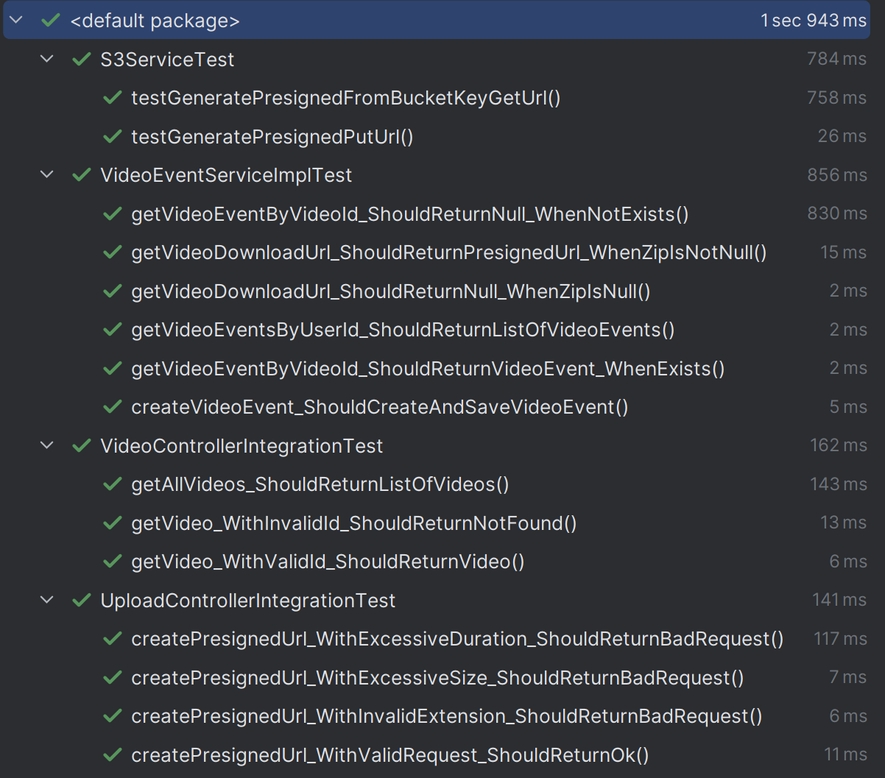
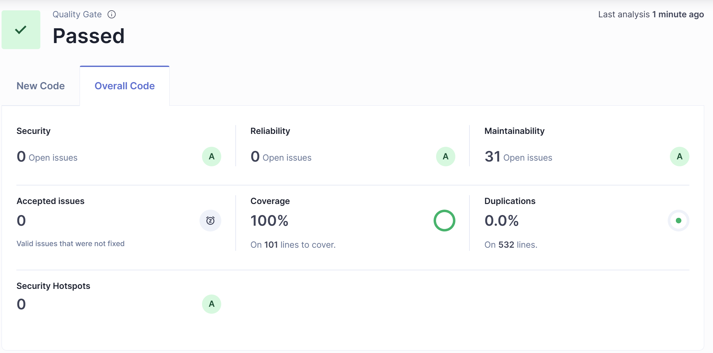
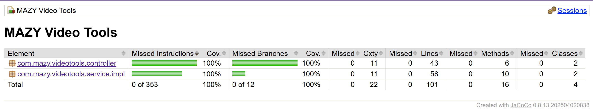

# MAZY Video Tools API

[](https://sonarcloud.io/summary/new_code?id=MAZY-Tech_mazy-video-tools-api)
[](https://sonarcloud.io/summary/new_code?id=MAZY-Tech_mazy-video-tools-api)
[](https://sonarcloud.io/summary/new_code?id=MAZY-Tech_mazy-video-tools-api)

Este serviço Spring Boot cria URLs pré-assinadas do S3 para o front-end fazer upload de vídeos diretamente para o Amazon S3.

## Funcionalidades

* **`POST /api/presign-upload`** – valida o nome do arquivo solicitado, tamanho (≤ 2 GB) e duração declarada (≤ 60 min) antes de retornar uma URL HTTPS `PUT` pré-assinada válida por 15 minutos.
* As credenciais AWS são injetadas com variáveis de ambiente **`AWS_ACCESS_KEY_ID` + `AWS_SECRET_ACCESS_KEY` + `AWS_SESSION_TOKEN`**; chaves de longa duração **não** são necessárias.
* A autenticação JWT é gerenciada pelo Spring Security + o endpoint JWKS do Cognito (`COGNITO_ISSUER_URI`).

## Executando localmente (Docker)

```bash
cp .env.example .env
docker compose up
```

## Variáveis

| Variável | Descrição |
|----------|-----------|
| `AWS_ACCESS_KEY_ID` | Chave de acesso temporária. |
| `AWS_SECRET_ACCESS_KEY` | Chave secreta temporária. |
| `AWS_SESSION_TOKEN` | Token de sessão temporário. |
| `AWS_REGION` | Região AWS (default `us-east-1`). |
| `UPLOAD_BUCKET_NAME` | Nome do bucket S3 onde os vídeos são armazenados. |
| `COGNITO_ISSUER_URI` | URI do emissor do seu Cognito User Pool (ex: `https://cognito-idp.<region>.amazonaws.com/<pool-id>`). |

## Makefile targets

* `make build` – compila o JAR
* `make docker-build` – gera a imagem Docker
* `make push` – envia a imagem para o ECR

---

## Qualidade do Código

### Testes unitários


### SonarQube


### Cobertura de Testes


---

## Participantes

- **Alison Israel - RM358367**  
  *Discord*: @taykarus | E-mail: taykarus@gmail.com

- **José Matheus de Oliveira - RM358854**  
  *Discord*: @jsmatheus | E-mail: matheusoliveira.info@gmail.com

- **Victor Zaniquelli - RM358533**  
  *Discord*: @zaniquelli | E-mail: zaniquelli@outlook.com.br

- **Yan Gianini - RM358368**  
  *Discord*: @.gianini | E-mail: yangianini@gmail.com
